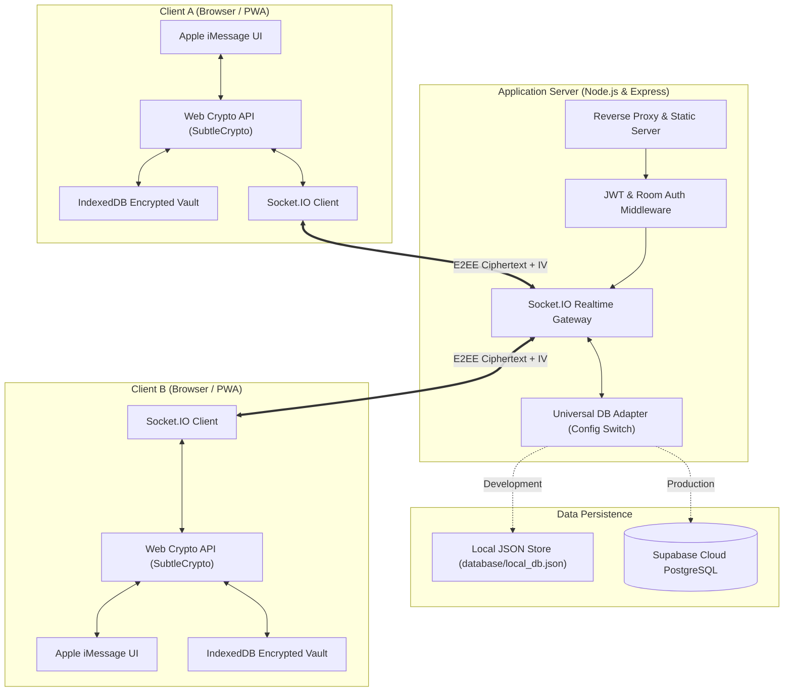
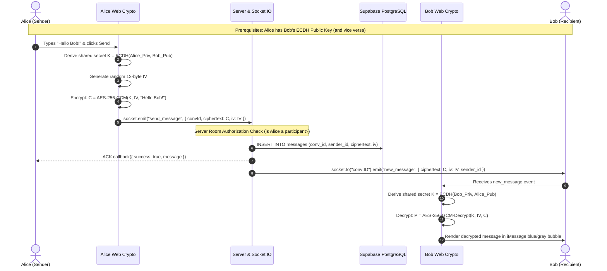
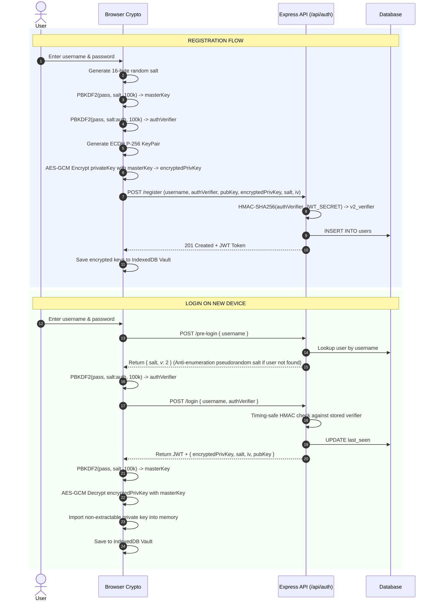

# 🔒 freeChat • Zero-Knowledge E2EE Private Messenger

<p align="center">
  
</p>

<p align="center">
  <strong>Zero-Knowledge End-to-End Encrypted Messenger with an Authentic Apple iMessage Liquid Glass User Experience.</strong>
</p>

<p align="center">
  <a href="#-cryptographic-specification"></a>
  <a href="#-cryptographic-specification"></a>
  <a href="#-features"></a>
  <a href="#-automated-testing--verification"></a>
  <a href="#-license"></a>
</p>

---

## 📑 Table of Contents

- [Overview](#-overview)
- [Zero-Knowledge Architecture](#-zero-knowledge-architecture)
- [Key Features](#-key-features)
- [Cryptographic Specification](#-cryptographic-specification)
  - [Security Primitives Table](#security-primitives-table)
  - [Key Lifecycle & Vault Storage](#key-lifecycle--vault-storage)
  - [Safety Numbers & MITM Defense](#safety-numbers--mitm-defense)
  - [Server-Side Anti-Replay & Privacy Protections](#server-side-anti-replay--privacy-protections)
- [Architecture & Data Flows](#-architecture--data-flows)
  - [System Topology](#system-topology)
  - [End-to-End Message Flow](#end-to-end-message-flow)
  - [Zero-Knowledge Registration & Login Flow](#zero-knowledge-registration--login-flow)
- [Tech Stack](#-tech-stack)
- [Project Directory Structure](#-project-directory-structure)
- [Getting Started](#-getting-started)
  - [Prerequisites](#prerequisites)
  - [Installation](#installation)
  - [Running Locally](#running-locally)
- [Environment Configuration](#-environment-configuration)
- [Database Persistence Options](#-database-persistence-options)
  - [Local Development Mode (Zero Configuration)](#local-development-mode-zero-configuration)
  - [Supabase PostgreSQL Cloud Setup](#supabase-postgresql-cloud-setup)
- [API & Realtime WebSocket Specification](#-api--realtime-websocket-specification)
  - [REST API Endpoints](#rest-api-endpoints)
  - [Socket.IO Realtime Events](#socketio-realtime-events)
- [Automated Testing & Verification](#-automated-testing--verification)
- [Threat Model & Security Analysis](#-threat-model--security-analysis)
- [Mobile Installation (Progressive Web App)](#-mobile-installation-progressive-web-app)
- [Production Deployment](#-production-deployment)
  - [Deploying to Render.com (100% Free)](#deploying-to-rendercom-100-free)
- [Contributing](#-contributing)
- [License](#-license)

---

## 🌐 Overview

**freeChat** is an open-source, Zero-Knowledge End-to-End Encrypted (E2EE) messaging platform created to provide uncompromised privacy without sacrificing visual elegance or ease of use.

Traditional messaging applications either route unencrypted text through central servers or wrap heavy desktop frameworks around web views. **freeChat** combines the **W3C Web Cryptography API** natively in modern browsers with an authentic **Apple iMessage Liquid Glass** user interface—featuring frosted glassmorphic panels (`backdrop-filter: blur`), dynamic ambient lighting meshes, fluid iOS spring animations, and native standalone PWA capability.

### 🛡️ Core Security Guarantee

> **The server and database only ever see ciphertext, public keys, and cryptographic vectors.**  
> Neither plaintext messages, user passwords, nor private key material ever leave the client's browser unencrypted. Even with complete database read access or compromised server infrastructure, an attacker cannot decrypt past or current conversations.

---

## 🔒 Zero-Knowledge Architecture

The core tenet of **freeChat** is mathematical privacy:

```
┌─────────────────────────────────────────────────────────────────────────┐
│                           CLIENT BROWSER                                │
│                                                                         │
│   Passphrase ────> PBKDF2 (100k rounds) ────> Master Key (KEK)         │
│                                                     │                   │
│   ECDH P-256 Key Pair ───> [Private Key] <──────────┘                   │
│         │                  (AES-256-GCM Backup)                         │
│         │                                                               │
│   [Public Key JWK]                                                      │
│         │                                                               │
└─────────┼───────────────────────────────────────────────────────────────┘
          │ (Transmits ONLY Public Key & Ciphertext)
          ▼
┌─────────────────────────────────────────────────────────────────────────┐
│                      UNTRUSTED SERVER & DATABASE                        │
│                                                                         │
│   • Ciphertext (AES-256-GCM)                                            │
│   • Initialization Vectors (12-byte IV)                                 │
│   • Public Keys (ECDH P-256 JWK)                                        │
│   • Encrypted Private Key Backups (AES-GCM encrypted)                   │
│   • PBKDF2 Auth Verifiers (HMAC-SHA256 hashed)                          │
│                                                                         │
│   ❌ NO Plaintext Messages    ❌ NO Raw Passwords    ❌ NO Private Keys │
└─────────────────────────────────────────────────────────────────────────┘
```

---

## ✨ Key Features

- 🛡️ **Zero-Knowledge Architecture**: The server and database operate blindly on ciphertext, never handling unencrypted data.
- 🔑 **Hardware-Grade Web Crypto**: Native browser `ECDH (P-256)` ephemeral key agreement paired with `AES-256-GCM` message encryption.
- 🎨 **Apple iMessage Liquid Glass Design**:
  - Translucent frosted glass layers with multi-layered specular borders.
  - Authentic iOS vibrant blue sender bubbles with directional tails and fluid typography.
  - Reactive ambient mesh lighting with seamless light/dark mode toggling.
  - Smooth spring physics (`cubic-bezier(0.175, 0.885, 0.32, 1.275)`).
- ⚡ **Realtime Engine (Socket.IO)**:
  - Authenticated WebSocket handshakes via JWT.
  - Sub-millisecond message delivery.
  - Animated typing indicator capsule (`...`).
  - Online/offline presence and dynamic last-seen timestamps.
- 🔢 **Cryptographic Safety Numbers & MITM Defense**:
  - Signal / WhatsApp standard **60-digit symmetric safety numbers** (12 blocks of 5 digits).
  - 16-character hex fingerprints (`XXXX-XXXX-XXXX-XXXX`).
  - Verified contact badges and automated alerts if a contact's public key changes.
- 🗄️ **Encrypted Client Vault at Rest**:
  - In-browser key storage in `IndexedDB` with `AES-256-GCM` envelope encryption.
  - Private keys imported as **non-extractable** (`extractable: false`), blocking runtime extraction by malicious browser extensions or XSS.
  - Multi-tab vault synchronization via `BroadcastChannel`.
- 🗃️ **Dual-Mode Persistence Adapter**:
  - **Local Development**: Built-in JSON database adapter (`database/local_db.json`) runs out-of-the-box offline with zero configuration.
  - **Production Cloud**: Supabase PostgreSQL with relational integrity, foreign keys, and performant indexes.
- 📱 **Installable Progressive Web App (PWA)**:
  - Add to Home Screen on iOS (Safari) and Android (Chrome).
  - Full-screen standalone mode with native safe-area and status bar support.
  - Service worker caching for offline shell reliability.
- 🧪 **Comprehensive Test Suite**: Automated 10-suite verification test covering crypto roundtrips, IDOR defense, room hijacking mitigation, and anti-enumeration.

---

## 🔐 Cryptographic Specification

### Security Primitives Table

| Cryptographic Operation | Standard / Algorithm | Parameters / Configuration | Security Purpose |
| :--- | :--- | :--- | :--- |
| **Asymmetric Key Agreement** | **ECDH** (NIST P-256 / secp256r1) | W3C Web Crypto `P-256` curve | Derives a shared 256-bit symmetric secret between sender and receiver without key transmission. |
| **Symmetric Message Cipher** | **AES-256-GCM** | 256-bit key, 96-bit (12-byte) random IV per message | Authenticated encryption providing confidentiality and integrity for all text messages. |
| **Master Key Derivation (KEK)** | **PBKDF2-HMAC-SHA256** | 100,000 iterations, 16-byte CSPRNG salt | Derives the Key Encryption Key (KEK) used to encrypt and decrypt the private key backup. |
| **Authentication Verifier** | **PBKDF2-HMAC-SHA256** + Server **HMAC-SHA256** | 100,000 rounds, `:auth` domain-separated salt, server-side `v2$` HMAC | Proves password knowledge to server without sending the password or derivation key. |
| **Key Vault Storage (Rest)** | **AES-256-GCM** + IndexedDB | 256-bit session vault key in `sessionStorage` | Encrypts private key material inside the browser's IndexedDB store. Zero plaintext on disk. |
| **Runtime Key Protection** | Non-Extractable `CryptoKey` | `extractable: false` | Prevents runtime memory exfiltration of raw private key coordinates (`d`) via XSS or scripts. |
| **Identity Verification** | **SHA-512** Canonical Key Digest | 60 decimal digits (12 × 5 blocks) + 16-char hex | Symmetrically computed safety number to detect Man-in-the-Middle (MITM) and key substitutions. |

---

### Key Lifecycle & Vault Storage

```
1. REGISTRATION:
   Passphrase + Salt ──────────> PBKDF2 (100,000 iters) ──────────> Master Key (KEK)
                                                                            │
   Generate ECDH P-256 KeyPair ─┬─> [Public Key JWK] ───────────────────────┼──> Stored in Server DB
                                └─> [Private Key JWK] ──> AES-256-GCM ──────┘──> Stored in Server DB
                                                              │
                                                        Encrypted Backup

2. RUNTIME RECOVERY (LOGIN):
   Passphrase + Server Salt ───> PBKDF2 (100,000 iters) ──────────> Master Key (KEK)
                                                                            │
   Server Encrypted Backup ───────────────────────────────────────> AES-256-GCM Decrypt
                                                                            │
                                                                   [Private Key JWK]
                                                                            │
                                                            crypto.subtle.importKey()
                                                                            │
                                                          ┌─────────────────┴──────────────────┐
                                                          ▼                                    ▼
                                                Non-Extractable Key                   Encrypted Vault
                                               (extractable = false)                    (IndexedDB)
                                              Used in browser memory            Encrypted with Session Vault Key
```

#### Why Non-Extractable Keys Matter
When a private key is imported into the browser's `SubtleCrypto` engine with `{ extractable: false }`, the browser engine forbids any JavaScript call to `crypto.subtle.exportKey()`. Even if an attacker injects a malicious script via an XSS vulnerability, they **cannot export the raw private key**. They can only request the browser to perform operations with the key handle during the active session.

---

### Safety Numbers & MITM Defense

To protect against Man-in-the-Middle (MITM) attacks—such as a rogue server substituting public keys—**freeChat** implements cryptographic safety numbers matching the Signal protocol standard:

1. **Canonical Serialization**: Both users' public keys are formatted into a deterministic JSON representation containing only sorted coordinates (`crv`, `kty`, `x`, `y`).
2. **Symmetric Sorting**: The two serialized keys are sorted lexicographically before hashing:
   $$\text{digest} = \text{SHA-512}(\min(K_A, K_B) \parallel "|" \parallel \max(K_A, K_B))$$
3. **60-Digit Block Generation**: The 64 bytes of SHA-512 output are split into 12 4-byte integers, mapped modulo $100{,}000$, and formatted as 12 5-digit groups:
   ```
   12345 67890 12345 67890 12345 67890 12345 67890 12345 67890 12345 67890
   ```
4. **Hex Fingerprint**: A secondary 16-character hexadecimal fingerprint is generated from SHA-256 (`XXXX-XXXX-XXXX-XXXX`).
5. **Key Change Alerting**: If an established contact's public key changes in the database, the UI displays a persistent **Security Alert Banner** and revokes the verified checkmark until re-verified.

---

### Server-Side Anti-Replay & Privacy Protections

- **Server-Side HMAC-SHA256 (`v2$`)**: Client-derived auth verifiers are hashed on the server using `crypto.createHmac('sha256', JWT_SECRET)` before being written to the database. Even if an attacker dumps the database, they cannot replay the stored verifier to log in (mitigating Pass-the-Hash attacks).
- **Timing-Safe Verifier Verification**: Password verifiers are verified using `crypto.timingSafeEqual()`, eliminating side-channel timing attacks.
- **Anti-Username Enumeration**: The `/api/auth/pre-login` endpoint returns a deterministic pseudorandom salt for non-existent users with identical HTTP status (`200 OK`) and latency, preventing attackers from harvesting valid usernames.
- **Zero Key Exposure on Pre-Login**: Unauthenticated callers never receive private key backups or IVs. Key backups are only returned in authenticated `/api/auth/login` responses.

---

## 🏗️ Architecture & Data Flows

### System Topology



---

### End-to-End Message Flow



---

### Zero-Knowledge Registration & Login Flow



---

## 💻 Tech Stack

| Layer | Technologies | Description |
| :--- | :--- | :--- |
| **Frontend Core** | Vanilla JavaScript (ES6+ Modules) | Zero bundler overhead, instant browser execution, minimal footprint. |
| **Frontend Styling** | Modern CSS3, CSS Custom Properties | Frosted glassmorphism (`backdrop-filter`), flexbox, grid, iOS system fonts. |
| **Cryptography** | W3C Web Cryptography API (`crypto.subtle`) | Native browser hardware-accelerated encryption; no untrusted third-party JS crypto libraries. |
| **Realtime** | Socket.IO (`4.8.1`), WebSockets | Low-latency bi-directional event transport with handshake authentication. |
| **Backend** | Node.js (`>=18`), Express (`4.21.2`) | High-performance asynchronous REST API and WebSocket host. |
| **Security / Auth** | JSON Web Tokens (`jsonwebtoken`), Node Crypto | Stateless session tokens, HMAC-SHA256 hashing, timing-safe equality. |
| **Cloud Database** | Supabase (PostgreSQL 15+) | Managed PostgreSQL with indexed foreign keys and connection pooling. |
| **Local Database** | Universal File Adapter (`database/local_db.json`) | Zero-configuration JSON store for offline local development and quick evaluation. |
| **App Shell / PWA** | Service Worker, Web App Manifest | Standalone mobile installability with iOS safe area and theme color support. |

---

## 📁 Project Directory Structure

```
freeChat/
├── .env.example              # Sample environment variables template
├── .gitignore                # Git ignore patterns (node_modules, .env, database/local_db.json)
├── README.md                 # Project documentation & architecture manual
├── package.json              # Project metadata, dependencies, and npm scripts
├── package-lock.json         # Pinned dependency tree
├── Video/                    # Demo recordings & visual walkthroughs
│   ├── 1.mp4
│   └── 2.mp4
├── database/
│   ├── schema.sql            # PostgreSQL production schema for Supabase
│   └── local_db.json         # Auto-generated local JSON database for offline mode
├── public/                   # Static web assets & client-side application
│   ├── css/
│   │   ├── variables.css     # Design tokens, color palette, spring transitions, light/dark vars
│   │   ├── glass.css         # Glassmorphic panels, frosted cards, blur filters, modal backdrops
│   │   ├── imessage.css      # Apple iMessage chat bubbles, tails, typing capsules, timestamps
│   │   └── main.css          # Core layouts, responsive breakpoints, resets, scrollbars
│   ├── js/
│   │   ├── api.js            # Fetch wrapper for authenticated REST API calls
│   │   ├── app.js            # Main application state machine, DOM event handlers, orchestrator
│   │   ├── crypto.js         # Web Crypto E2EE engine, PBKDF2, vault store, safety numbers
│   │   ├── socket.js         # Socket.IO connection manager, reconnect logic, event dispatcher
│   │   └── ui.js             # UI rendering components (bubbles, toasts, dividers, escaping)
│   ├── favicon.svg           # Vector lock logo
│   ├── icon-192.png          # PWA home screen icon (192x192)
│   ├── icon-512.png          # PWA splash screen icon (512x512)
│   ├── index.html            # Main Single Page Application HTML shell
│   ├── manifest.json         # Progressive Web App web manifest
│   └── sw.js                 # Service worker for offline shell caching
├── server/                   # Backend application server
│   ├── config/
│   │   └── db.js             # Universal DB adapter (Supabase PostgreSQL / Local JSON fallback)
│   ├── middleware/
│   │   └── auth.js           # JWT verification middleware & session generator
│   ├── routes/
│   │   ├── auth.js           # Registration, pre-login, login, profile endpoints
│   │   └── chat.js           # User search, conversation management, message history
│   └── server.js             # Express app entry, HTTP server, Socket.IO realtime router
└── test/
    └── verify.js             # Automated 10-suite security and integration test runner
```

---

## 🚀 Getting Started

### Prerequisites

- **Node.js**: Version `18.0.0` or higher (supports native Web Crypto and ES modules).
- **npm**: Version `8.0.0` or higher.
- A modern web browser supporting the Web Crypto API (Chrome, Safari, Firefox, Edge).

### Installation

1. **Clone the repository**:
   ```bash
   git clone https://github.com/Reyadh418/freeChat.git
   cd freeChat
   ```

2. **Install project dependencies**:
   ```bash
   npm install
   ```

3. **Configure environment variables (optional for local mode)**:
   ```bash
   cp .env.example .env
   ```
   > **Note**: If `.env` is omitted or Supabase keys are not provided, **freeChat automatically activates its built-in local database engine**. You can run immediately without signing up for any cloud services!

---

### Running Locally

- **Start in production mode**:
  ```bash
  npm start
  ```
- **Start in development watch mode** (auto-restarts on code changes):
  ```bash
  npm run dev
  ```
- Open your browser and navigate to:
  ```
  http://localhost:3000
  ```

---

## ⚙️ Environment Configuration

Create a `.env` file in the project root to configure runtime parameters:

| Variable | Type | Required | Default Value | Description |
| :--- | :--- | :--- | :--- | :--- |
| `PORT` | Number | Optional | `3000` | Port on which the Express and Socket.IO server will listen. |
| `JWT_SECRET` | String | Recommended | *Built-in dev key* | Cryptographic secret for signing session tokens. **Must be a strong random 64-character string in production**. |
| `SUPABASE_URL` | String | Optional | *Empty (Local mode)* | Full Supabase project URL (`https://your-project-id.supabase.co`). |
| `SUPABASE_KEY` | String | Optional | *Empty (Local mode)* | Supabase `anon` or `service_role` API key. |
| `NODE_ENV` | String | Optional | `development` | Runtime environment (`development` or `production`). |

---

## 🗄️ Database Persistence Options

### Local Development Mode (Zero Configuration)

When `SUPABASE_URL` or `SUPABASE_KEY` is not present in `.env`, `server/config/db.js` initializes the built-in local filesystem adapter:

- Stores records in `database/local_db.json`.
- Initializes collections for `users`, `conversations`, `conversation_participants`, and `messages`.
- Automatically ignored by `.gitignore` to prevent committing mock user data.
- Allows team members or contributors to clone and test with zero setup friction.

### Supabase PostgreSQL Cloud Setup

For cloud persistence and scalable production deployments:

1. Create a free account at [Supabase.com](https://supabase.com) and create a new project.
2. In your Supabase project dashboard, navigate to the **SQL Editor**.
3. Copy and paste the complete contents of [`database/schema.sql`](database/schema.sql) and click **Run**.
4. Navigate to **Project Settings $\rightarrow$ API** and copy:
   - **Project URL**
   - **anon / public** API Key
5. Update your `.env` file:
   ```env
   SUPABASE_URL=https://xxxxxxxxxxxxxxxxxxxx.supabase.co
   SUPABASE_KEY=eyJhbGciOiJIUzI1NiIsInR5cCI6IkpXVCJ9...
   ```
6. Restart your server (`npm start`). The health check endpoint (`/api/health`) will now report `"db_mode": "supabase_cloud"`.

#### PostgreSQL Relational Schema Summary

```sql
users (
    id UUID PRIMARY KEY DEFAULT gen_random_uuid(),
    username TEXT UNIQUE NOT NULL,
    auth_verifier TEXT NOT NULL,
    public_key TEXT NOT NULL,
    encrypted_priv_key TEXT NOT NULL,
    salt TEXT NOT NULL,
    iv TEXT NOT NULL,
    avatar_color TEXT DEFAULT '#007AFF',
    status_message TEXT DEFAULT 'Hey there! I am using freeChat.',
    last_seen TIMESTAMPTZ DEFAULT NOW(),
    created_at TIMESTAMPTZ DEFAULT NOW()
);

conversations (
    id UUID PRIMARY KEY DEFAULT gen_random_uuid(),
    type TEXT NOT NULL CHECK (type IN ('direct', 'group')) DEFAULT 'direct',
    title TEXT,
    created_by UUID REFERENCES users(id) ON DELETE SET NULL,
    created_at TIMESTAMPTZ DEFAULT NOW(),
    updated_at TIMESTAMPTZ DEFAULT NOW()
);

conversation_participants (
    conversation_id UUID REFERENCES conversations(id) ON DELETE CASCADE,
    user_id UUID REFERENCES users(id) ON DELETE CASCADE,
    encrypted_group_key TEXT,
    role TEXT DEFAULT 'member',
    joined_at TIMESTAMPTZ DEFAULT NOW(),
    PRIMARY KEY (conversation_id, user_id)
);

messages (
    id UUID PRIMARY KEY DEFAULT gen_random_uuid(),
    conversation_id UUID REFERENCES conversations(id) ON DELETE CASCADE,
    sender_id UUID REFERENCES users(id) ON DELETE CASCADE,
    ciphertext TEXT NOT NULL,
    iv TEXT NOT NULL,
    sender_public_key TEXT,
    media_url TEXT,
    media_type TEXT,
    ephemeral_expires_at TIMESTAMPTZ,
    created_at TIMESTAMPTZ DEFAULT NOW()
);
```

---

## 📡 API & Realtime WebSocket Specification

### REST API Endpoints

#### Authentication Routes (`/api/auth`)

| Method | Endpoint | Auth Required | Description | Request Body / Parameters | Response |
| :--- | :--- | :--- | :--- | :--- | :--- |
| `POST` | `/api/auth/register` | No | Creates a new user account with zero-knowledge keys | `{ username, auth_verifier, public_key, encrypted_priv_key, salt, iv, avatar_color }` | `201 Created` + JWT token and sanitized user profile |
| `POST` | `/api/auth/pre-login` | No | Fetches public derivation salt for client PBKDF2 calculation | `{ username }` | `200 OK` + `{ salt, v: 2 }` (Anti-enumeration pseudorandom salt for non-existent users) |
| `POST` | `/api/auth/login` | No | Authenticates user via auth verifier token | `{ username, auth_verifier }` | `200 OK` + JWT token, encrypted private key backup, and salt/iv |
| `GET` | `/api/auth/me` | Yes (Bearer) | Validates active session token and fetches profile | *None* | `200 OK` + user profile data |
| `GET` | `/api/auth/user/:username` | Yes (Bearer) | Fetches public identity and public key for a contact | Route parameter `:username` | `200 OK` + `{ id, username, public_key, avatar_color, last_seen }` |

#### Chat Routes (`/api/chat`)

| Method | Endpoint | Auth Required | Description | Request Body / Parameters | Response |
| :--- | :--- | :--- | :--- | :--- | :--- |
| `GET` | `/api/chat/users/search` | Yes (Bearer) | Searches users by username prefix (excluding caller) | Query `?q=search_term` | `200 OK` + Array of matching user public profiles |
| `GET` | `/api/chat/conversations` | Yes (Bearer) | Lists all active conversations for the caller | *None* | `200 OK` + Array of conversations with participant lists and last messages |
| `POST` | `/api/chat/conversations/direct` | Yes (Bearer) | Finds or initializes a 1-on-1 direct conversation | `{ targetUsername }` | `200 OK` + Conversation record and target user details |
| `GET` | `/api/chat/conversations/:convId/messages` | Yes (Bearer) | Fetches encrypted message history for conversation (IDOR/BOLA protected) | Route param `:convId`, query `?limit=100` | `200 OK` + Array of encrypted message objects |

#### System Health (`/api/health`)

| Method | Endpoint | Description | Response |
| :--- | :--- | :--- | :--- |
| `GET` | `/api/health` | Service liveness probe and active database engine check | `200 OK` + `{ status: "ok", timestamp, db_mode }` |

---

### Socket.IO Realtime Events

#### Handshake Authentication
All Socket.IO connections must pass a verified JWT in the handshake:
```javascript
const socket = io({
  auth: { token: "your-jwt-session-token" }
});
```

#### Event Catalog

| Event Name | Direction | Payload Structure | Description |
| :--- | :--- | :--- | :--- |
| `online_users_list` | Server $\rightarrow$ Client | `string[]` (User IDs) | Emitted upon connect containing array of all currently online user IDs. |
| `user_status_change` | Server $\rightarrow$ Client | `{ userId, status: 'online' \| 'offline', lastSeen }` | Broadcast to all connected clients when a user connects or disconnects. |
| `join_conversation` | Client $\rightarrow$ Server | `convId: string, callback` | Requests joining conversation room `conv:convId`. Server validates caller participation before joining. |
| `leave_conversation` | Client $\rightarrow$ Server | `convId: string` | Leaves conversation room. |
| `typing_start` | Client $\rightarrow$ Server | `{ conversationId }` | Emits typing state. Server checks participant membership and relays to peer. |
| `typing_stop` | Client $\rightarrow$ Server | `{ conversationId }` | Clears typing state. |
| `user_typing` | Server $\rightarrow$ Client | `{ conversationId, userId, username, isTyping }` | Sent to participants when a peer starts or stops typing. |
| `send_message` | Client $\rightarrow$ Server | `{ conversationId, ciphertext, iv, senderPublicKey }` | Sends encrypted payload. Server enforces sender ID from JWT token. |
| `new_message` | Server $\rightarrow$ Client | `{ id, conversation_id, sender_id, ciphertext, iv, created_at }` | Dispatched to all conversation participants in room. |
| `conversation_updated` | Server $\rightarrow$ Client | `{ conversationId, lastMessage }` | Dispatched to peer's personal user room (`user:recipientId`) to update sidebar preview. |

---

## 🧪 Automated Testing & Verification

**freeChat** includes an end-to-end automated verification suite that validates every cryptographic primitive, authorization boundary, and security control.

Run the test suite with:

```bash
npm test
```

### Verification Test Suites

```
🧪 Starting freeChat Automated Verification Suite...

[1/10] Testing Zero-Knowledge Web Crypto Engine (ECDH P-256 + AES-256-GCM)...
  ✅ Cryptographic Roundtrip Passed: Decrypted message matches original plaintext perfectly!

[2/10] Testing Zero-Knowledge PBKDF2 Master Key Derivation & Private Key Backup Recovery...
  ✅ Zero-Knowledge Key Backup & Decryption on Login Passed!

[3/10] Testing Universal Database Adapter & Schema...
  ✅ User Creation & Query Passed
  ✅ Conversation Creation Passed
  ✅ Participant Lookup Passed
  ✅ Encrypted Message Storage Passed: Stored only Ciphertext & IV in DB
  ✅ User Search Passed

[4/10] Testing Username Validation Rules...
  ✅ Username Validation Rules Passed

[5/10] Testing JWT Authentication & IDOR / BOLA Authorization Controls...
  ✅ Unauthenticated Request Rejected with 401 Unauthorized
  ✅ Tampered/Invalid Token Rejected with 401 Unauthorized
  ✅ Valid JWT Accepted and User Context Attached to Request
  ✅ Object-Level Authorization (IDOR/BOLA Defense): Non-participant access blocked

[6/10] Testing Socket.IO Realtime Handshake Auth, Room Isolation & Anti-Spoofing...
  ✅ Unauthenticated Socket Handshake Blocked
  ✅ Tampered/Forged Socket Handshake Blocked
  ✅ Legitimate Socket Handshake Authenticated and User Identity Bound
  ✅ Room Hijacking Prevention: Non-participants denied conversation room access
  ✅ Identity Spoofing Blocked: Server strictly binds sender_id to authenticated socket identity

[7/10] Testing Pre-Login Anti-Enumeration & Zero Unauthenticated Key Exposure...
  ✅ Private Key Concealment: Pre-login returns salt only, zero encrypted keys exposed
  ✅ Anti-Enumeration: Non-existent accounts return identical 200 OK with pseudorandom salt
  ✅ Profile Endpoint Protection: Public scraping blocked, authenticated access allowed

[8/10] Testing Hardened PBKDF2 Auth Verifier & Server-Side HMAC Protection...
  ✅ Client-Side PBKDF2 Verifier (100,000 rounds) Produced Valid 256-bit Key
  ✅ Server-Side Storage: Verifier protected with HMAC-SHA256 (v2$ prefix)
  ✅ Timing-Safe Equality: Valid verifier verified, invalid verifier rejected
  ✅ Pass-the-Hash Defense: Stored DB verifier cannot be replayed directly for login

[9/10] Testing Safety Numbers, Key Verification & MITM Prevention...
  ✅ Symmetric Safety Number matches symmetrically on both peers
  ✅ MITM Defense: Attacker-substituted public key generates mismatched safety number & fingerprint
  ✅ Key Change Detection: Verified contacts flag key substitutions and trigger security alert

[10/10] Testing Encrypted KeyStore at Rest & Non-Extractable Private Keys...
  ✅ Zero-Plaintext at Rest: Private key encrypted with AES-256-GCM, raw "d" coordinate scrubbed
  ✅ Vault Decryption: Successfully decrypted original private key using session vault key
  ✅ Tamper & Extraction Resistance: Decryption fails without authenticated session vault key
  ✅ Non-Extractable Enforcement: crypto.subtle.exportKey blocked for in-memory private key
  ✅ Functional Verification: Non-extractable private key derives shared secret successfully

====================================================
🎉 ALL AUTOMATED VERIFICATION TESTS PASSED SUCCESSFULLY!
====================================================
```

---

## 🛡️ Threat Model & Security Analysis

| Threat Scenario | Attacker Capability | freeChat Defense & Mitigation |
| :--- | :--- | :--- |
| **Compromised Database / Server Dump** | Complete read access to all database tables. | **Complete Protection**. The database holds only AES-256-GCM ciphertext, public keys, and encrypted private key backups. Passwords and master keys are never sent to the server. Stored verifiers use server HMAC (`v2$`), preventing pass-the-hash attacks. |
| **Rogue / Malicious Server (MITM)** | The server attempts to substitute Bob's public key with Mallory's key. | **Detected by Safety Numbers**. Alice and Bob's 60-digit safety numbers will mismatch immediately. If a contact was previously verified, freeChat displays a prominent warning banner and key-change alert. |
| **Passive Network Eavesdropper (ISP / Public Wi-Fi)** | Snooping on HTTP/WebSocket traffic. | **Double Layer Protection**. TLS/HTTPS encrypts transport; Web Crypto AES-256-GCM ensures message payloads remain unbreakable ciphertext even if TLS terminates at an intermediate proxy. |
| **Cross-Site Scripting (XSS) / Malicious Extensions** | Script attempts to extract private keys from the DOM / memory. | **Non-Extractable CryptoKey**. In-memory private keys are marked `extractable: false`. The browser's C++ crypto subsystem blocks `exportKey()` requests. IndexedDB records are encrypted at rest with session vault keys. |
| **Account Enumeration / Harvesting** | Script scans usernames against login/pre-login endpoints. | **Anti-Enumeration Defense**. `/pre-login` computes and returns a deterministic HMAC salt for invalid usernames, giving identical response codes and timing profiles. |
| **Insecure Direct Object Reference (IDOR / BOLA)** | User attempts to fetch messages from another conversation via API or WebSocket room injection. | **Strict Participant Authorization**. Both `/api/chat/conversations/:id/messages` and Socket `join_conversation` / `send_message` verify participant membership before allowing access. |

---

## 📲 Mobile Installation (Progressive Web App)

**freeChat** is engineered as a zero-compromise Progressive Web App (PWA) that installs as a native-feeling application on both iOS and Android without third-party app store downloads:

### iOS (Safari)
1. Open your deployed freeChat URL in **Safari**.
2. Tap the **Share** button (the square with an arrow pointing upward).
3. Scroll down and tap **Add to Home Screen**.
4. Tap **Add** in the top-right corner.
5. Launch **freeChat** from your home screen. It runs in full-screen standalone mode with native iOS status bar and safe-area margins.

### Android (Chrome)
1. Open the URL in **Google Chrome**.
2. Tap the three-dot menu icon in the upper right.
3. Select **Install App** or **Add to Home Screen**.
4. Confirm by tapping **Install**.

---

## ☁️ Production Deployment

### Deploying to Render.com (100% Free)

You can host **freeChat** permanently on **Render's Free Tier**:

1. Fork or push this repository to your GitHub account:
   ```bash
   git add .
   git commit -m "Deploy freeChat"
   git push origin main
   ```
2. Log in to [Render.com](https://render.com) and click **New + $\rightarrow$ Web Service**.
3. Connect your GitHub repository.
4. Configure service parameters:
   - **Name**: `freechat` (or your preferred name)
   - **Region**: Select the region closest to you
   - **Branch**: `main`
   - **Root Directory**: *(leave blank)*
   - **Runtime**: `Node`
   - **Build Command**: `npm install`
   - **Start Command**: `npm start`
   - **Instance Type**: `Free`
5. In the **Environment Variables** section, add:
   - `NODE_ENV`: `production`
   - `JWT_SECRET`: *(Generate a secure random string, e.g. using `openssl rand -hex 32`)*
   - `SUPABASE_URL`: *(Your Supabase project URL)*
   - `SUPABASE_KEY`: *(Your Supabase anon or service key)*
6. Click **Create Web Service**.
7. Render will build and deploy your service. Your private encrypted messenger is now live with free automated SSL/TLS certificates!

---

## 🤝 Contributing

Contributions to **freeChat** are warmly welcomed! Please follow these steps:

1. Fork the repository.
2. Create a feature branch (`git checkout -b feature/amazing-feature`).
3. Ensure all automated tests pass (`npm test`).
4. Commit your changes with descriptive messages (`git commit -m 'Add amazing feature'`).
5. Push to the branch (`git push origin feature/amazing-feature`).
6. Open a Pull Request.

---

## 📄 License

This project is licensed under the **MIT License** - see the [LICENSE](LICENSE) file for details.

---

<p align="center">
  Built with ❤️ for privacy, freedom of speech, and craftsmanship.
</p>

