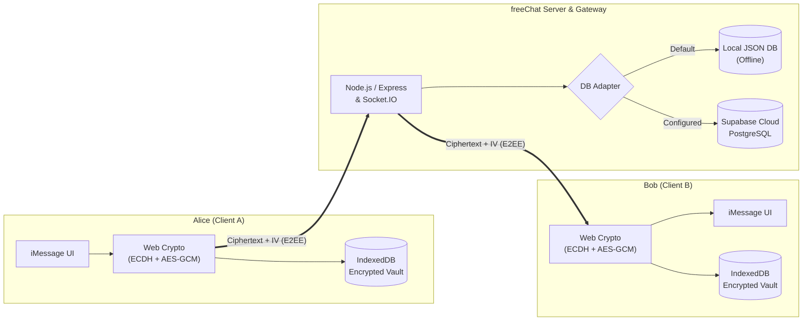

# 🔒 freeChat

<p align="center">
  
</p>

<p align="center">
  <strong>Zero-Knowledge End-to-End Encrypted Messenger</strong><br>
  <em>Built with Apple iMessage Liquid Glass aesthetics, native Web Crypto, and real-time WebSockets.</em>
</p>

<p align="center">
  
  
  
  
  
</p>

---

## 💡 Overview

**freeChat** is a private, Zero-Knowledge End-to-End Encrypted (E2EE) messaging web application designed for both complete data sovereignty and consumer-grade visual elegance.

Built with pure Vanilla JavaScript (ES Modules), modern CSS3 glassmorphism, Node.js, and Supabase PostgreSQL, freeChat enforces mathematical privacy: **the server and database only ever see ciphertext, public keys, and cryptographic initialization vectors**. Unencrypted messages, raw passwords, and private keys never leave the client's browser.

---

## ✨ Features

- 🛡️ **Zero-Knowledge Architecture**: The server and database never receive plaintext messages, passwords, or raw private keys.
- 🔑 **Hardware-Grade Web Crypto**: Native browser `ECDH (P-256)` shared key agreement combined with `AES-256-GCM` message encryption.
- 📱 **Apple iMessage Liquid Glass UI**: Frosted glassmorphic surfaces (`backdrop-filter: blur`), dynamic ambient lighting, iOS blue bubbles, spring animations, and native dark/light theme switching.
- ⚡ **Realtime Engine**: Socket.IO bi-directional WebSocket delivery, live typing indicator capsule (`...`), and online/offline user presence.
- 🔢 **Safety Numbers & MITM Defense**: 60-digit symmetric safety numbers and 16-character hex fingerprints to verify contact keys and alert against key substitution attacks.
- 🗄️ **Encrypted Client Key Vault**: In-browser `IndexedDB` storage protected with session vault encryption and non-extractable private keys (`extractable: false`).
- 🗃️ **Dual-Mode Persistence**: Run out-of-the-box offline with the built-in local JSON adapter (`database/local_db.json`), or link Supabase PostgreSQL for cloud scale.
- 📲 **Installable PWA**: Add to iOS Safari or Android Chrome home screen for a full-screen, standalone native app experience.
- ☁️ **100% Free Cloud Deployment**: Runs permanently on **Render Free Tier** (Node.js backend) + **Supabase Free Tier** (PostgreSQL).

---

## 🔐 Cryptographic Specification

| Component | Standard / Algorithm | Role in freeChat |
| :--- | :--- | :--- |
| **Key Agreement** | **ECDH (NIST P-256 / secp256r1)** | Derives shared 256-bit symmetric secrets between participants without transmitting keys |
| **Message Cipher** | **AES-256-GCM (12-byte IV)** | Authenticated symmetric encryption for all message text payloads |
| **Master Key (KEK)** | **PBKDF2 (100,000 iterations, SHA-256)** | Derives master key from passphrase to encrypt private key backup |
| **Auth Verifier** | **PBKDF2 (`:auth`) + Server HMAC-SHA256** | Zero-knowledge password verification token; immune to pass-the-hash attacks |
| **Local Key Vault** | **AES-256-GCM + IndexedDB** | Encrypts private keys at rest in the browser; synced across tabs via `BroadcastChannel` |
| **In-Memory Protection** | **Non-Extractable `CryptoKey`** | `extractable: false` blocks memory extraction of private keys via DOM / XSS |
| **Identity Verification** | **SHA-512 Canonical Key Digest** | 60-digit numeric safety number and 16-character hex fingerprint for MITM defense |

---

## 🏗️ Architecture & Data Flow



### Trust Boundary Summary

- **Client-Side (Trusted)**: Key generation, key agreement, encryption, decryption, safety number comparison, and passphrase derivation occur exclusively in the browser.
- **Server-Side (Untrusted)**: Routes ciphertext between authenticated socket rooms, stores encrypted payloads, tracks presence, and enforces conversation membership.

---

## 🚀 Quick Start

### Prerequisites

- **Node.js** >= `18.0.0`
- **npm** >= `8.0.0`

### 1. Clone & Install

```bash
git clone https://github.com/Reyadh418/freeChat.git
cd freeChat
npm install
```

### 2. Run the App

```bash
npm start
```

For auto-reloading development mode:
```bash
npm run dev
```

Open **`http://localhost:3000`** in your browser.

> 💡 **Zero-Config Local Mode**: freeChat runs immediately out of the box using its built-in local database adapter (`database/local_db.json`). No external database or API key is required for local testing!

---

## ⚙️ Environment Variables

Create a `.env` file in the root directory if you want to customize ports, secrets, or connect Supabase:

```env
# Server Port (Default: 3000)
PORT=3000

# JWT Signing Secret (Recommended in production)
JWT_SECRET=your-random-64-character-secret-key

# Supabase Cloud Configuration (Optional)
SUPABASE_URL=https://your-project-id.supabase.co
SUPABASE_KEY=your-supabase-anon-or-service-key
```

---

## ☁️ Connecting Supabase (Cloud Persistence)

To enable persistent cloud storage across multiple devices:

1. Create a free project at [Supabase.com](https://supabase.com).
2. Open the **SQL Editor** in your Supabase dashboard and run [`database/schema.sql`](database/schema.sql).
3. Copy your **Project URL** and **anon/public API key** from *Project Settings $\rightarrow$ API*.
4. Add them to your `.env` file:
   ```env
   SUPABASE_URL=https://your-project-id.supabase.co
   SUPABASE_KEY=your-supabase-anon-key
   ```
5. Restart your server (`npm start`). freeChat will automatically switch from local JSON to Supabase PostgreSQL.

---

## 📡 API & Realtime Overview

### REST API

| Method | Endpoint | Auth | Description |
| :--- | :--- | :--- | :--- |
| `POST` | `/api/auth/register` | No | Creates a user account with encrypted key backup & auth verifier |
| `POST` | `/api/auth/pre-login` | No | Returns key derivation salt (anti-enumeration protected) |
| `POST` | `/api/auth/login` | No | Validates zero-knowledge auth verifier and returns JWT |
| `GET` | `/api/auth/me` | Bearer | Validates active session token |
| `GET` | `/api/auth/user/:username` | Bearer | Fetches public profile and ECDH public key |
| `GET` | `/api/chat/users/search?q=` | Bearer | Searches users by username |
| `GET` | `/api/chat/conversations` | Bearer | Lists conversations for authenticated user |
| `POST` | `/api/chat/conversations/direct` | Bearer | Creates or retrieves a 1-on-1 direct conversation |
| `GET` | `/api/chat/conversations/:id/messages` | Bearer | Retrieves encrypted message history (participant verified) |
| `GET` | `/api/health` | No | Health probe & active database mode indicator |

### Realtime Socket.IO Events

- **Handshake Auth**: Connections authenticate with `{ auth: { token } }`.
- **Presence**: `online_users_list`, `user_status_change` broadcast real-time online status.
- **Typing Indicators**: `typing_start` / `typing_stop` trigger the animated typing bubble (`...`).
- **Messaging**: `send_message` delivers encrypted payloads to conversation rooms (`conv:id`) and notifies recipient rooms (`user:id`).

---

## 🧪 Automated Verification

freeChat includes a comprehensive automated test suite verifying all cryptographic guarantees, object-level authorization, and anti-tampering measures:

```bash
npm test
```

### Test Coverage Highlights (15 Suites)
- ✅ **Web Crypto Engine**: Complete ECDH P-256 derivation & AES-256-GCM encryption/decryption roundtrip.
- ✅ **Zero-Knowledge Backup**: Passphrase recovery, PBKDF2 derivation, and client backup restoration.
- ✅ **Database & RLS**: PostgreSQL Row Level Security (RLS) policies and cloud adapter integrity.
- ✅ **Atomic Local Storage**: Concurrency-safe atomic writes and automated corruption backup preservation.
- ✅ **IDOR / BOLA Defense**: Strict authorization preventing unauthorized access to conversations and messages.
- ✅ **Socket Security**: Handshake JWT authentication, room isolation, and anti-spoofing identity binding.
- ✅ **Anti-Enumeration**: Pre-login deterministic pseudorandom salts for non-existent users.
- ✅ **Auth Verifier Hardening**: Server-side HMAC-SHA256 (`v2$`) hashing and timing-safe equality checks.
- ✅ **Safety Numbers**: 60-digit symmetric safety number verification and MITM key change detection.
- ✅ **Vault Security**: Non-extractable in-memory keys (`extractable: false`) and zero-plaintext storage at rest.
- ✅ **Network Hardening**: Rate limiting, brute-force defense, IP anti-spoofing, and real-time typing flood throttling.
- ✅ **Fail-Secure Config**: Strict rejection of insecure fallback secrets in production mode.

---

## 📲 Install as an App (PWA)

freeChat is configured as a standalone Progressive Web App:

- **iOS (Safari)**: Tap the **Share** button $\rightarrow$ tap **Add to Home Screen** $\rightarrow$ tap **Add**.
- **Android (Chrome)**: Tap the menu icon ($\vdots$) $\rightarrow$ tap **Install App** / **Add to Home Screen**.

Once added, freeChat launches full-screen with native glass fluid animations, system status bar integration, and no browser address bar.

---

## 🌐 Free Cloud Deployment (Render.com)

Deploy freeChat permanently on **Render's Free Tier**:

1. Push your repository to GitHub.
2. Go to [Render.com](https://render.com) $\rightarrow$ **New +** $\rightarrow$ **Web Service**.
3. Connect your repository and configure:
   - **Environment**: `Node`
   - **Build Command**: `npm install`
   - **Start Command**: `npm start`
4. Add **Environment Variables**:
   - `NODE_ENV`: `production`
   - `JWT_SECRET`: *(A secure random 64-character string)*
   - `SUPABASE_URL`: *(Your Supabase URL, if using cloud DB)*
   - `SUPABASE_KEY`: *(Your Supabase anon/service key, if using cloud DB)*
5. Click **Create Web Service**. Your private encrypted messenger is live with automatic free SSL/TLS!

---

## 📄 License

This project is open-source and licensed under the [MIT License](LICENSE).
