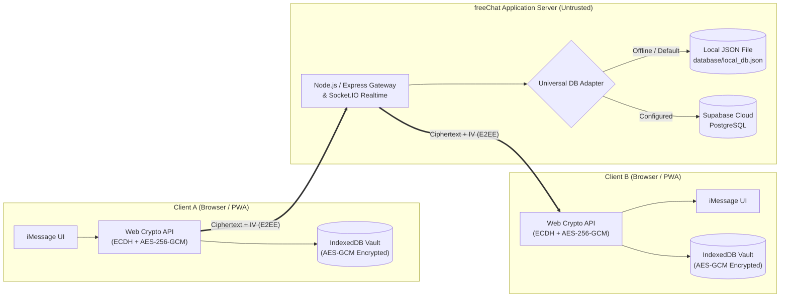

# 🔒 freeChat

<p align="center">
  
</p>

<p align="center">
  <strong>Zero-Knowledge End-to-End Encrypted Private Messenger</strong><br>
  <em>Engineered with Apple iMessage Liquid Glass aesthetics, native W3C Web Cryptography, and real-time WebSockets.</em>
</p>

<p align="center">
  
  
  
  
  
  
</p>

---

## 📑 Table of Contents

- [Overview](#-overview)
- [Zero-Knowledge Architecture](#-zero-knowledge-architecture)
- [Key Features](#-key-features)
- [Cryptographic Specification](#-cryptographic-specification)
  - [Security Primitives](#security-primitives)
  - [Key Exchange & Message Encryption](#key-exchange--message-encryption)
  - [Non-Extractable In-Memory Keys](#non-extractable-in-memory-keys)
  - [Safety Numbers & MITM Defense](#safety-numbers--mitm-defense)
- [System Architecture](#-system-architecture)
- [Project Directory Structure](#-project-directory-structure)
- [Getting Started](#-getting-started)
  - [Prerequisites](#prerequisites)
  - [Installation & Local Run](#installation--local-run)
- [Configuration & Environment](#-configuration--environment)
- [Database Persistence Options](#-database-persistence-options)
  - [Zero-Config Local Mode](#1-zero-config-local-mode-default)
  - [Supabase PostgreSQL Cloud Setup](#2-supabase-postgresql-cloud-setup)
- [API & Realtime Reference](#-api--realtime-reference)
  - [REST Endpoints](#rest-endpoints)
  - [Socket.IO Events](#socketio-realtime-events)
- [Threat Model & Security Matrix](#-threat-model--security-matrix)
- [Automated Verification Suite](#-automated-verification-suite)
- [Mobile Installation (PWA)](#-mobile-installation-pwa)
- [Production Deployment](#-production-deployment)
- [License](#-license)

---

## 💡 Overview

**freeChat** is an open-source, Zero-Knowledge End-to-End Encrypted (E2EE) messaging platform built to combine uncompromising mathematical privacy with the refined design language of **Apple iMessage Liquid Glass**.

Unlike traditional web messengers that rely on third-party JavaScript crypto libraries or server-side decryption, freeChat executes all cryptographic operations directly inside the browser using the hardware-accelerated **W3C Web Cryptography API** (`window.crypto.subtle`).

### 🛡️ The Zero-Knowledge Trust Model

- **The Server & Database Are Untrusted**: The backend and database only ever receive ciphertext, public keys, and cryptographic initialization vectors (IVs).
- **Zero Plaintext Transmission**: Messages, master keys, and private keys never leave the client device unencrypted.
- **Data at Rest Protection**: Even in the event of a full server infrastructure compromise or database breach, stored messages cannot be decrypted by an attacker.

---

## ✨ Key Features

### 🔐 Cryptography & Privacy
- **Hardware-Accelerated Web Crypto**: Native browser `ECDH (P-256)` ephemeral key agreement combined with `AES-256-GCM` message encryption.
- **Zero-Knowledge Key Derivation**: User master keys derived via `PBKDF2-HMAC-SHA256` (100,000 iterations) with CSPRNG per-user salts.
- **Anti-Pass-the-Hash Verifiers**: Client authentication tokens are hashed server-side with HMAC-SHA256 (`v2$`) and compared using timing-safe equality checks.
- **In-Memory Key Hardening**: Private keys are loaded as non-extractable (`extractable: false`), preventing memory dumping via cross-site scripting (XSS).
- **Safety Numbers & Fingerprints**: Signal/WhatsApp standard 60-digit symmetric safety numbers and 16-character hex fingerprints to detect Man-in-the-Middle (MITM) attacks.

### 🎨 Apple iMessage Liquid Glass Interface
- **Frosted Glass Panels**: Deep blur backdrop filters (`backdrop-filter: blur(25px)`), translucent floating headers, and multi-layered specular borders.
- **Authentic iMessage Bubbles**: Vibrant iOS blue sender bubbles with directional tails, adaptive typography, and smooth spring physics.
- **Dynamic Themes**: Seamless light and dark mode with reactive ambient background mesh lighting and iOS status bar tinting.
- **Interactive Feedback**: Real-time typing capsule (`...`), online presence indicators, and animated message delivery states.

### ⚡ Engineering & Architecture
- **Realtime WebSockets**: Low-latency Socket.IO delivery with JWT handshake authentication and room-level authorization checks.
- **Dual-Mode Database Adapter**: Instant offline development via the built-in local JSON file store (`database/local_db.json`), with seamless one-switch migration to Supabase PostgreSQL.
- **Installable PWA**: Service-worker caching and web app manifest for a full-screen, standalone app experience on iOS and Android.
- **100% Free Cloud Stack**: Permanently deployable on **Render Free Tier** (Node.js) paired with **Supabase Free Tier** (PostgreSQL).

---

## 🔐 Cryptographic Specification

### Security Primitives

| Component | Standard / Algorithm | Configuration | Security Purpose |
| :--- | :--- | :--- | :--- |
| **Key Agreement** | **ECDH** (NIST P-256 / secp256r1) | W3C Web Crypto `P-256` curve | Derives shared 256-bit symmetric secrets between participants without transmitting keys over the wire |
| **Message Cipher** | **AES-256-GCM** | 256-bit key, 96-bit (12-byte) random IV | Authenticated encryption providing confidentiality and integrity for chat payloads |
| **Master Key (KEK)** | **PBKDF2-HMAC-SHA256** | 100,000 iterations, 16-byte CSPRNG salt | Derives the Key Encryption Key used to encrypt and decrypt the user's private key backup |
| **Auth Verifier** | **PBKDF2** + Server **HMAC-SHA256** | 100,000 iterations, `:auth` domain separation | Proves password knowledge to server without sending the raw password or master key |
| **Client Key Vault** | **AES-256-GCM** + **IndexedDB** | Session vault key in `sessionStorage` | Encrypts private keys at rest on the client; synced across tabs via `BroadcastChannel` |
| **Runtime Hardening** | **Non-Extractable `CryptoKey`** | `extractable: false` | Prevents JavaScript runtime extraction of raw private key coordinates (`d`) |
| **Identity Verification** | **SHA-512** Canonical Key Digest | 60 decimal digits (12 × 5 blocks) + 16-char hex | Symmetrically computed safety number to verify contact keys and defeat MITM attacks |

### Key Exchange & Message Encryption

1. **Key Agreement**: When Alice initiates a chat with Bob, Alice's browser retrieves Bob's public ECDH key. Using Bob's public key and Alice's private key, the browser computes a shared secret:
   ```
   Shared Secret K = ECDH(Alice_PrivateKey, Bob_PublicKey)
   ```
2. **Authenticated Encryption**: For every message, a cryptographically secure 12-byte initialization vector (`IV`) is generated via `window.crypto.getRandomValues()`. The plaintext is encrypted using `AES-256-GCM`:
   ```
   Ciphertext C, Tag T = AES-256-GCM-Encrypt(K, IV, Plaintext)
   ```
3. **Transmission**: Alice transmits `{ conversationId, ciphertext: C, iv: IV }` through Socket.IO. The server stores and relays only the ciphertext and IV.
4. **Decryption**: Bob computes the identical shared secret $K = \text{ECDH}(\text{Bob\_PrivateKey}, \text{Alice\_PublicKey})$ and decrypts the payload in browser memory.

### Non-Extractable In-Memory Keys

When freeChat imports the user's private key into browser memory, it specifies `{ extractable: false }`. The browser's native C++ crypto implementation prohibits any JavaScript code from calling `crypto.subtle.exportKey()` on that key object. Even in the event of an injected script or malicious extension, the raw private key cannot be exfiltrated from memory.

### Safety Numbers & MITM Defense

To ensure that no rogue server or proxy has substituted a contact's public key:
- Both users' public keys are canonically formatted (sorted coordinates `crv`, `kty`, `x`, `y`).
- The keys are sorted lexicographically and hashed with `SHA-512`.
- The output is formatted into **12 blocks of 5 decimal digits (60 digits total)** matching the Signal / WhatsApp standard.
- If both parties compare safety numbers and confirm they match, active MITM eavesdropping is mathematically impossible.
- If a contact's key changes in the database, freeChat revokes the verified checkmark and presents an immediate **Security Alert Banner**.

---

## 🏗️ System Architecture



---

## 📁 Project Directory Structure

```
freeChat/
├── database/
│   ├── schema.sql            # PostgreSQL production schema & RLS policies
│   └── local_db.json         # Local JSON store (auto-generated for offline mode)
├── public/                   # Frontend SPA client
│   ├── css/
│   │   ├── variables.css     # Design tokens, color palette, spring curves
│   │   ├── glass.css         # Glassmorphism, backdrop blurs, modal surfaces
│   │   ├── imessage.css      # Apple iMessage chat bubbles, tails, typing pills
│   │   └── main.css          # Layouts, responsive breakpoints, resets
│   ├── js/
│   │   ├── api.js            # Authenticated REST API wrapper
│   │   ├── app.js            # Application state machine & DOM orchestrator
│   │   ├── crypto.js         # Web Crypto E2EE engine, vault store, safety numbers
│   │   ├── socket.js         # Socket.IO connection manager & event dispatcher
│   │   └── ui.js             # UI rendering, toasts, and DOM sanitation
│   ├── favicon.svg           # Application lock emblem
│   ├── index.html            # Main Single Page Application shell
│   ├── manifest.json         # Progressive Web App manifest
│   └── sw.js                 # Service worker for offline shell caching
├── server/                   # Backend application server
│   ├── config/
│   │   └── db.js             # Universal DB adapter (Supabase PostgreSQL / Local JSON)
│   ├── middleware/
│   │   └── auth.js           # JWT verification, security headers, rate limiting
│   ├── routes/
│   │   ├── auth.js           # Registration, pre-login, login, user profile
│   │   └── chat.js           # Search, conversation management, message history
│   └── server.js             # Express app entry, HTTP server, Socket.IO router
├── test/
│   └── verify.js             # Automated 15-suite verification & security test runner
├── .env.example              # Environment variables template
├── package.json              # Project dependencies & npm scripts
└── README.md                 # Technical architecture manual
```

---

## 🚀 Getting Started

### Prerequisites

- **Node.js** >= `18.0.0` (supports native Web Crypto and ES modules)
- **npm** >= `8.0.0`

### Installation & Local Run

1. **Clone the repository**:
   ```bash
   git clone https://github.com/Reyadh418/freeChat.git
   cd freeChat
   ```

2. **Install dependencies**:
   ```bash
   npm install
   ```

3. **Start the application**:
   ```bash
   npm start
   ```

   For auto-reloading development mode:
   ```bash
   npm run dev
   ```

4. Open **`http://localhost:3000`** in your browser.

> 💡 **Immediate Offline Evaluation**: freeChat initializes its built-in local JSON database (`database/local_db.json`) automatically when no external database is configured. You can start chatting and testing immediately without creating accounts or setting up cloud services.

---

## ⚙️ Configuration & Environment

To configure production secrets or cloud persistence, create a `.env` file in the project root:

```bash
cp .env.example .env
```

| Variable | Required | Default Value | Description |
| :--- | :--- | :--- | :--- |
| `PORT` | Optional | `3000` | HTTP and WebSocket listening port |
| `JWT_SECRET` | Recommended | *Built-in dev key* | Secret for signing session tokens (must be a strong 64-character key in production) |
| `SUPABASE_URL` | Optional | *Empty (Local mode)* | Full Supabase project URL (`https://your-project-id.supabase.co`) |
| `SUPABASE_KEY` | Optional | *Empty (Local mode)* | Supabase `anon` or `service_role` API key |
| `NODE_ENV` | Optional | `development` | Environment mode (`development` or `production`) |

---

## 🗄️ Database Persistence Options

### 1. Zero-Config Local Mode (Default)
When `SUPABASE_URL` is omitted, the universal database adapter (`server/config/db.js`) uses local file storage:
- Stores records in `database/local_db.json`.
- Implements concurrency-safe atomic file writes with `.tmp` staging and `fs.renameSync`.
- Automatically generates timestamped recovery backups if malformed JSON is encountered.

### 2. Supabase PostgreSQL Cloud Setup
For scalable, multi-device cloud storage:

1. Create a project at [Supabase.com](https://supabase.com).
2. In the Supabase Dashboard, open the **SQL Editor** and run the contents of [`database/schema.sql`](database/schema.sql).
3. Copy your **Project URL** and **API Key** from *Project Settings $\rightarrow$ API*.
4. Update your `.env` file:
   ```env
   SUPABASE_URL=https://your-project-id.supabase.co
   SUPABASE_KEY=your-supabase-anon-key
   ```
5. Restart the server (`npm start`). freeChat will automatically connect to Supabase PostgreSQL.

---

## 📡 API & Realtime Reference

### REST Endpoints

| Method | Endpoint | Auth | Description |
| :--- | :--- | :--- | :--- |
| `POST` | `/api/auth/register` | Public | Registers a new account with encrypted key backup and auth verifier |
| `POST` | `/api/auth/pre-login` | Public | Returns key derivation salt (anti-enumeration protected) |
| `POST` | `/api/auth/login` | Public | Validates zero-knowledge auth verifier and issues session JWT |
| `GET` | `/api/auth/me` | Bearer | Validates active session token and returns user profile |
| `GET` | `/api/auth/user/:username` | Bearer | Returns public identity and public key for a contact |
| `GET` | `/api/chat/users/search?q=` | Bearer | Searches registered users by username |
| `GET` | `/api/chat/conversations` | Bearer | Lists all active conversations for the authenticated user |
| `POST` | `/api/chat/conversations/direct` | Bearer | Initializes or retrieves a 1-on-1 direct conversation |
| `GET` | `/api/chat/conversations/:id/messages` | Bearer | Retrieves encrypted message history (enforces participant membership) |
| `GET` | `/api/health` | Public | System liveness probe and active database engine indicator |

### Socket.IO Realtime Events

| Event Name | Direction | Description |
| :--- | :--- | :--- |
| `connection` | Client $\rightarrow$ Server | Authenticates connection using handshake token (`auth: { token }`) |
| `online_users_list` | Server $\rightarrow$ Client | Transmits array of currently active user IDs upon connect |
| `user_status_change` | Server $\rightarrow$ Client | Broadcasts real-time online/offline presence changes |
| `join_conversation` | Client $\rightarrow$ Server | Joins conversation room `conv:id` (server validates participant membership) |
| `typing_start` / `typing_stop` | Client $\rightarrow$ Server | Emits typing state; throttled server-side to prevent room flooding |
| `user_typing` | Server $\rightarrow$ Client | Relays typing indicator capsule to conversation participants |
| `send_message` | Client $\rightarrow$ Server | Sends encrypted payload; server enforces sender ID from JWT token |
| `new_message` | Server $\rightarrow$ Client | Dispatches ciphertext and IV to all conversation participants |
| `conversation_updated` | Server $\rightarrow$ Client | Notifies recipient's personal room (`user:id`) to refresh sidebar snippet |

---

## 🛡️ Threat Model & Security Matrix

| Attack Vector | Threat Scenario | freeChat Defense & Mitigation |
| :--- | :--- | :--- |
| **Compromised Database** | Attacker obtains full read access to database storage | **Mathematically Protected**. Database contains only AES-256-GCM ciphertext, public keys, and encrypted private key backups. No unencrypted messages, master keys, or passwords ever touch disk. |
| **Malicious / Rogue Server** | Server attempts to substitute Bob's public key (MITM) | **Detected by Safety Numbers**. Symmetrically derived 60-digit safety numbers will mismatch. Stored contact records trigger an immediate visual key-change warning banner. |
| **Network Eavesdropping** | Attacker intercepts traffic on unencrypted Wi-Fi | **Transport + Payload Encryption**. HTTPS/WSS encrypts transit; Web Crypto AES-256-GCM ensures message payloads remain unbreakable ciphertext even if TLS terminates at an intermediate proxy. |
| **DOM Injection / XSS** | Malicious script attempts to steal in-memory keys | **Non-Extractable Keys**. In-memory private keys are marked `extractable: false`. The browser's native crypto implementation refuses to export raw key coordinates. |
| **Username Enumeration** | Attacker scans `/pre-login` to harvest active accounts | **Anti-Enumeration Defense**. The endpoint computes and returns a deterministic pseudorandom salt for non-existent users with identical HTTP status (`200 OK`) and latency. |
| **Replay / Pass-the-Hash** | Attacker captures auth verifier to impersonate user | **Server HMAC Protection**. Auth verifiers are hashed server-side with HMAC-SHA256 (`v2$`). The stored database hash cannot be replayed as a client login token. |

---

## 🧪 Automated Verification Suite

freeChat includes an end-to-end automated verification suite covering cryptography, authorization boundaries, concurrency, and network security.

Run the test suite:

```bash
npm test
```

### Coverage (15 Verified Suites)
- [x] **Web Crypto Engine**: Complete ECDH P-256 key agreement & AES-256-GCM encryption roundtrip.
- [x] **Zero-Knowledge Key Backup**: PBKDF2 derivation, client-side encryption, and cross-device recovery.
- [x] **Database & Schema**: User/conversation CRUD operations, participant indexing, and message persistence.
- [x] **Username Validation**: Strict character whitelisting (3–30 chars: lowercase, numbers, `_`, `-`, `.`).
- [x] **IDOR / BOLA Defense**: Strict object-level authorization blocking non-participant conversation access.
- [x] **Socket Security**: Handshake authentication, room access verification, and sender identity spoofing prevention.
- [x] **Anti-Enumeration**: Pre-login deterministic pseudorandom salts and zero unauthenticated key exposure.
- [x] **Auth Verifier Hardening**: PBKDF2 (`:auth`) derivation, server HMAC hashing, and timing-safe equality.
- [x] **Safety Numbers & MITM Defense**: Symmetric 60-digit number computation and key-substitution alerting.
- [x] **Vault Security**: Encrypted client storage at rest and non-extractable in-memory keys (`extractable: false`).
- [x] **HTTP Security Headers**: Strict Content Security Policy (CSP), HSTS, and X-Frame-Options clickjacking protection.
- [x] **Rate Limiting**: Brute-force throttling on authentication endpoints and IP anti-spoofing verification.
- [x] **PostgreSQL RLS**: Verification of Row Level Security policies for multi-tenant database isolation.
- [x] **Atomic Local Storage**: Concurrency-safe atomic writes and automated corruption backup preservation.
- [x] **Deep Hardening**: Strict registration schema validation and real-time typing flood throttling.

---

## 📲 Mobile Installation (PWA)

freeChat functions as a standalone Progressive Web App with zero third-party app store requirements:

- **iOS (Safari)**: Open the URL $\rightarrow$ tap **Share** $\rightarrow$ tap **Add to Home Screen** $\rightarrow$ tap **Add**.
- **Android (Chrome)**: Open the URL $\rightarrow$ tap the menu ($\vdots$) $\rightarrow$ tap **Install App** / **Add to Home Screen**.

When launched from the home screen, freeChat runs full-screen with native iOS safe-area adaptation, status bar tinting, and no browser chrome.

---

## 🌐 Production Deployment

### Deploying to Render.com (100% Free)

1. Push your repository to GitHub:
   ```bash
   git add .
   git commit -m "Deploy freeChat"
   git push origin main
   ```
2. Log in to [Render.com](https://render.com) and click **New + $\rightarrow$ Web Service**.
3. Connect your GitHub repository.
4. Configure service settings:
   - **Environment**: `Node`
   - **Build Command**: `npm install`
   - **Start Command**: `npm start`
   - **Instance Type**: `Free`
5. Under **Environment Variables**, add:
   - `NODE_ENV`: `production`
   - `JWT_SECRET`: *(A secure random 64-character string)*
   - `SUPABASE_URL`: *(Your Supabase project URL)*
   - `SUPABASE_KEY`: *(Your Supabase anon/service key)*
6. Click **Create Web Service**. Your private encrypted messenger is live with automatic free SSL/TLS!

---

## 📄 License

This project is open-source and licensed under the [MIT License](LICENSE).

---

<p align="center">
  Built with ❤️ for privacy, freedom of speech, and craftsmanship.
</p>
